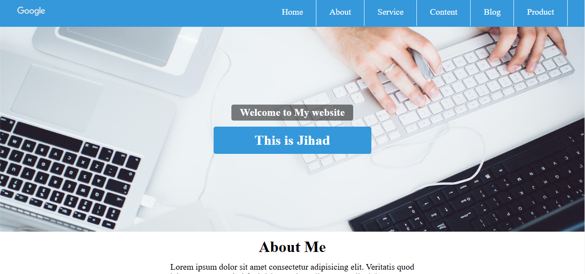

# My First Website

This is my very first website project created using only HTML and CSS. The website is simple and focuses on fundamental web design techniques, including structuring content and styling with CSS.

## Project Overview

- **Technologies Used**: HTML, CSS
- **Purpose**: Learning and practicing basic web development

## Features

- Responsive layout
- Basic styling with CSS

